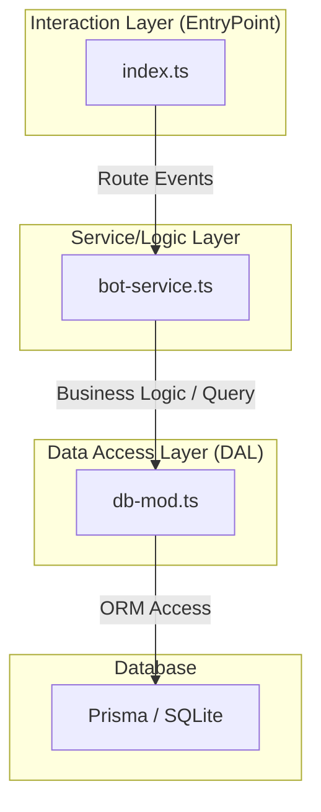

# 요구사항

DB 관련 코드는 `db-mod.ts`에서 관리하며,
`bot-service.ts`에서 비즈니스 로직을 처리하고,
`index.ts`에서는 봇의 진입점 및 이벤트 라우팅을 담당.

```
db-mod.ts
bot-service.ts
index.ts
```

# 소프트웨어 설계 문서: 출석체크 봇 (디스코드)

## 1. 목적
사용자가 매일 출석을 기록하고, 동일한 날짜 내 중복 출석을 방지하며, 누적 출석 횟수를 추적할 수 있는 디스코드 출석체크 봇을 설계 및 구현. 시스템은 데이터베이스 작업과 봇의 메인 로직을 분리.

## 2. 주요 파일 및 컨텍스트
- `index.ts`: 디스코드 봇의 엔트리 포인트. 상호작용, 슬래시 명령어, 봇 이벤트를 수신하여 적절한 서비스 핸들러로 라우팅.
- `bot-service.ts`: 서비스/로직 계층. 출석 처리(`/출석`) 및 버튼 상호작용과 같은 비즈니스 로직을 포함.
- `db-mod.ts`: 데이터 액세스 계층. Prisma를 사용하여 사용자의 출석 상태를 쿼리하고 업데이트하는 모든 로직을 포함.
- `prisma/schema.prisma`: 데이터 모델 및 데이터베이스 설정(SQLite)을 정의.
- `.env`: `DISCORD_TOKEN` 및 `CLIENT_ID`와 같은 민감한 설정을 저장.

## 3. 시스템 아키텍처
애플리케이션은 다음과 같은 계층형 아키텍처를 따름:
1.  **상호작용 계층 (index.ts)**: 디스코드 API와 상호작용하고, 명령어를 수신하여 사용자에게 데이터를 표시.
2.  **서비스/로직 계층 (bot-service.ts)**: 출석 로직 처리 및 버튼 이벤트 대응 등 비즈니스 프로세스를 수행.
3.  **데이터 액세스 계층 (db-mod.ts)**: Prisma ORM을 통해 데이터베이스와 인터페이스.
4.  **데이터베이스 (SQLite)**: 사용자 출석 데이터를 영구 저장.

## 4. 데이터베이스 스키마

### `User` 모델


| 필드명 | 타입 | 설명 |
| :--- | :--- | :--- |
| `id` | `String` | 고유 디스코드 사용자 ID (Primary Key). |
| `lastAttendance` | `DateTime` | 가장 최근 출석 시간. |
| `attendanceCount` | `Int` | 총 성공적인 출석 횟수 (기본값: 0). |

## 5. 모듈 정의

### `db-mod.ts` (데이터 액세스)
- `getAttendanceCount(userId: string): Promise<number>`
    - 특정 사용자의 총 출석 횟수를 가져옴.
- `checkIsAlreadyAttended(userId: string): Promise<boolean>`
    - 현재 날짜와 사용자의 `lastAttendance`를 비교하여 오늘 이미 체크인했는지 여부를 확인.
- `processAttendance(userId: string): Promise<User>`
    - `upsert` 작업을 수행하여 `lastAttendance`를 현재 시간으로 업데이트하고 `attendanceCount`를 증가.

### `bot-service.ts` (서비스 로직)
- `handleAttendance(interaction: Interaction)`
    - `/출석` 명령어에 대한 비즈니스 로직을 처리합니다. 중복 여부를 확인하고 결과를 응답.
- `handleButtonCommand(interaction: Interaction)`
    - `/버튼` 명령어 요청 시 테스트 버튼을 생성하여 응답.
- `handleButtonInteraction(interaction: Interaction)`
    - 버튼 클릭 이벤트를 감지하고 처리.

### `index.ts` (메인 봇 로직)
- **슬래시 명령어 등록**:
    - `/출석`: 출석 프로세스를 시작.
    - `/버튼`: 테스트용 버튼 메시지를 전송.
- **이벤트 리스너**:
    - `ClientReady`: 로그인 성공 로그를 출력.
    - `InteractionCreate`: 슬래시 명령어 및 버튼 상호작용을 `bot-service.ts`의 핸들러로 전달.

### Module Diagram



## 6. 검증 및 테스트
- **기능 테스트**: 디스코드에서 `/출석` 명령어를 실행.
    - 첫 출석 시 횟수가 증가하고 날짜가 설정되는지 확인.
    - 동일한 날에 다시 `/출석`을 시도했을 때 거부되는지 확인.
- **통합 테스트**: `prisma studio` 또는 `select-all.ts`를 사용하여 `db-mod.ts` 함수가 `dev.db` 파일을 업데이트하는지 확인.
- **환경 확인**: `.env` 파일에 유효한 디스코드 자격 증명이 올바르게 설정되었는지 확인.

## Screenshot


## Related Posts
- [디스코드 출석체크 봇 2 - Event Driven Architecture]()
- [discord-bot-gemini 4.22 수정]()
- [discord.js의 Interaction 타입]()
- [discord.js의 Client 이벤트 목록]()
- [Docker sandbox 실행 + Discord Bot 통합]()
- [Discord Echo 봇 환경 구축 및 실행]()
- [Discord 매 10분 자동 메시지 전송 기능 구현]()
- [Discord bot 환경 변수 적용 및 타입 에러를 수정]()
- [디스코드 봇 개발 주제 모음]()
- [디스코드 출석체크 봇 1 - 초기설정, 로그인 기능]()
- [디스코드 출석체크 봇 3 - db기능만 떼어서 실험]()
