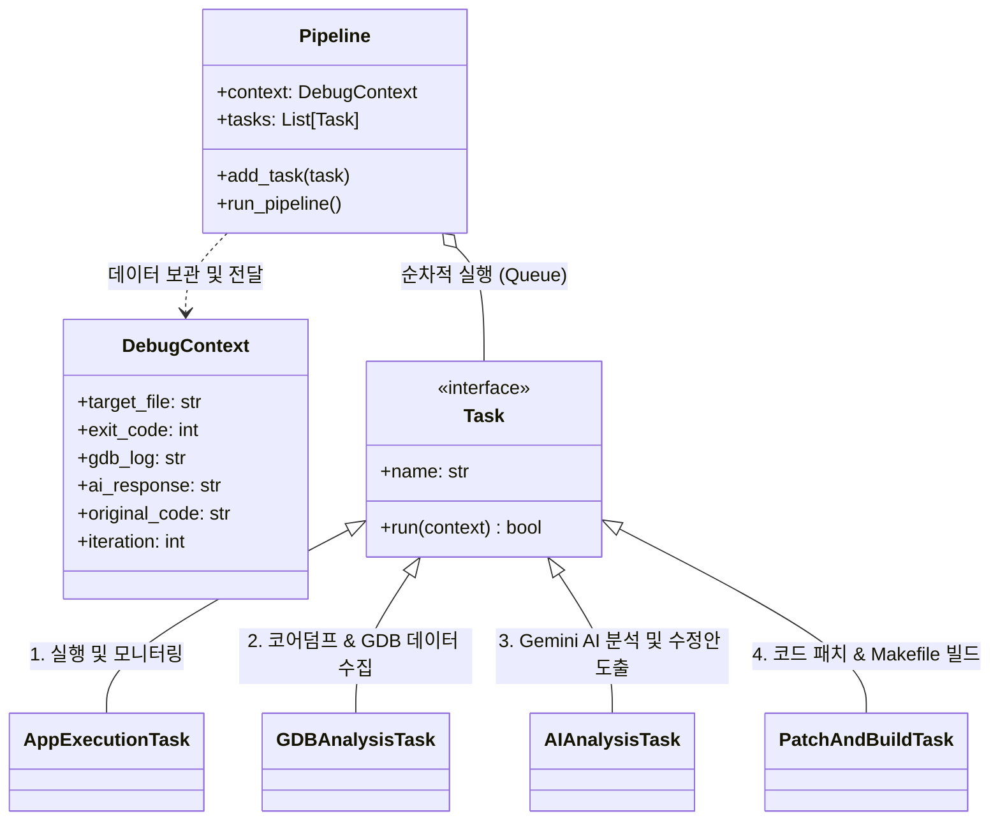

## AI 기반 디버깅 루프 POC
- task로 하나의 업무를 추상화
- pipeline으로 한줄로 엮기

## Code

``` python

import sys

# --- 1. 데이터 컨테이너 (바구니) ---
class DebugContext:
    def __init__(self, target_file):
        self.target_file = target_file
        self.iteration = 0
        print(f"[Context] '{target_file}' 분석을 위한 컨테이너가 생성되었습니다.")

# --- 2. 태스크 기본 설계 (인터페이스) ---
class Task:
    def __init__(self, name):
        self.name = name

    def run(self, context: DebugContext) -> bool:
        # 이 부분이 각 Task가 수행할 '한 줄' 핵심 로직입니다.
        raise NotImplementedError

# --- 3. 개별 태스크 정의 (실제 수행될 작업들) ---
class AppExecutionTask(Task):
    def run(self, context):
        print(f"[Task: {self.name}] 앱을 실행하여 크래시 여부를 감시합니다.")
        return True # 다음 단계로 진행 (실제로는 크래시 발생 시 True)

class GDBAnalysisTask(Task):
    def run(self, context):
        print(f"[Task: {self.name}] core.dump에서 상세 디버깅 데이터를 추출합니다.")
        return True

class AIAnalysisTask(Task):
    def run(self, context):
        print(f"[Task: {self.name}] Gemini AI가 수정된 전체 코드를 생성하고 리포트를 작성합니다.")
        return True

class PatchAndBuildTask(Task):
    def run(self, context):
        print(f"[Task: {self.name}] difflib으로 만든 패치를 적용하고 'make'를 실행합니다.")
        return True

# --- 4. 파이프라인 관리자 ---
class Pipeline:
    def __init__(self, context: DebugContext):
        self.context = context
        self.tasks = []

    def add_task(self, task: Task):
        self.tasks.append(task)

    def run_pipeline(self):
        print(f"\n--- {self.context.iteration}회차 파이프라인 가동 ---")
        for task in self.tasks:
            if not task.run(self.context):
                print(f"{task.name}에서 오류가 발생하여 파이프라인이 중단되었습니다.")
                return False
        return True

# --- 5. 메인 실행 루프 ---
if __name__ == "__main__":
    # 초기 설정
    ctx = DebugContext("main.cpp")
    pipe = Pipeline(ctx)

    # 파이프라인에 작업 순서대로 등록
    pipe.add_task(AppExecutionTask("앱 실행 및 모니터링"))
    pipe.add_task(GDBAnalysisTask("GDB 데이터 추출"))
    pipe.add_task(AIAnalysisTask("Gemini AI 분석"))
    pipe.add_task(PatchAndBuildTask("패치 적용 및 빌드"))

    # 루프 시뮬레이션
    for i in range(1, 3): # 2회 반복 테스트
        ctx.iteration = i
        if pipe.run_pipeline():
            print(f"[Git] '{i}회차 성공' 상태를 커밋합니다.")
        else:
            break

    print("\n모든 프로세스 골격 테스트가 완료되었습니다.")

```

``` text
(my_local_py) ~/work/gdb_py_pipeline/project$ python pipeline_test.py
[Context] 'main.cpp' 분석을 위한 컨테이너가 생성되었습니다.

--- 1회차 파이프라인 가동 ---
[Task: 앱 실행 및 모니터링] 앱을 실행하여 크래시 여부를 감시합니다.
[Task: GDB 데이터 추출] core.dump에서 상세 디버깅 데이터를 추출합니다.
[Task: Gemini AI 분석] Gemini AI가 수정된 전체 코드를 생성하고 리포트를 작성합니다.
[Task: 패치 적용 및 빌드] difflib으로 만든 패치를 적용하고 'make'를 실행합니다.
[Git] '1회차 성공' 상태를 커밋합니다.

--- 2회차 파이프라인 가동 ---
[Task: 앱 실행 및 모니터링] 앱을 실행하여 크래시 여부를 감시합니다.
[Task: GDB 데이터 추출] core.dump에서 상세 디버깅 데이터를 추출합니다.
[Task: Gemini AI 분석] Gemini AI가 수정된 전체 코드를 생성하고 리포트를 작성합니다.
[Task: 패치 적용 및 빌드] difflib으로 만든 패치를 적용하고 'make'를 실행합니다.
[Git] '2회차 성공' 상태를 커밋합니다.

모든 프로세스 골격 테스트가 완료되었습니다.
```


## 다이어그램




